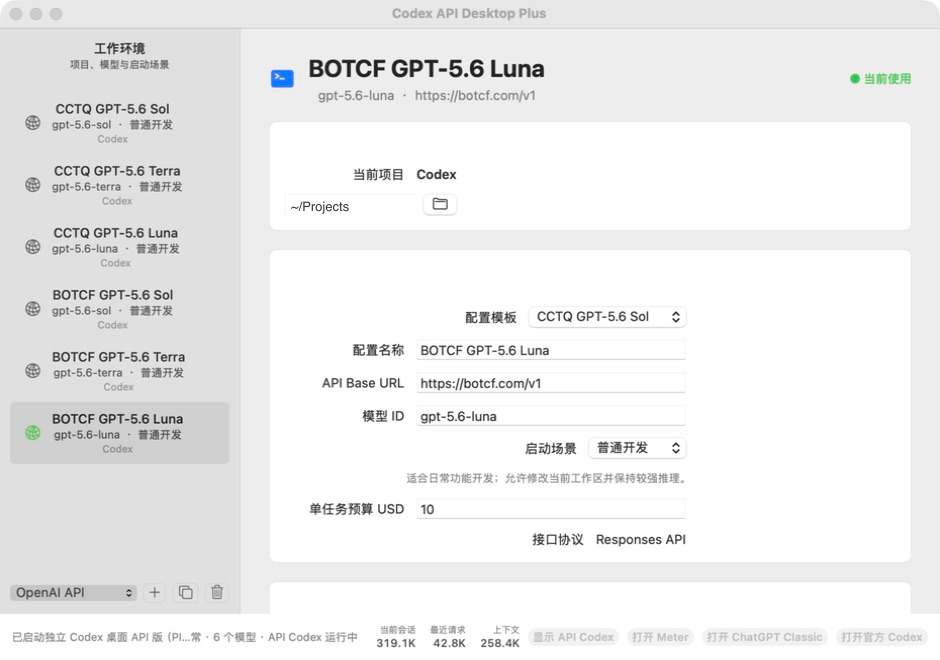

# Codex API Desktop Plus

[](https://www.apple.com/macos/)
[](https://www.swift.org/)
[](CHANGELOG.md)

一个原生 macOS 配置管理器，用于管理 OpenAI-compatible Responses API
配置，并启动与官方 Codex 数据隔离的 API 版 Codex 桌面进程。

> [!IMPORTANT]
> 本项目是非官方社区工具，与 OpenAI 无隶属或背书关系。Codex 和 OpenAI
> 是其各自权利人的商标。

<p align="center">
  
</p>

## 当前版本

**2.13.0**, 2026-07-12

- [下载 Codex API Desktop Plus 2.13.0](https://github.com/zps-31/codex-api-desktop/raw/refs/heads/main/downloads/Codex-API-Desktop-Plus-2.13.0.zip)
- SHA-256: `3ed57233491a1f4983e5c46012d4351d00b069925f898ccf90cceb29646a7bb3`
- 完整变更: [CHANGELOG.md](CHANGELOG.md)

## 主要功能

- 管理 API Base URL、模型 ID、认证方式、项目目录和启动场景。
- 在左侧列表新增、复制、删除和切换模型配置。
- API Key 只保存到 macOS 钥匙串。
- 启动前检查凭据、工作目录、模型目录和目标模型。
- 使用独立 `CODEX_HOME` 与桌面数据目录，不修改官方 `~/.codex`。
- 本机 Responses API 路由自动选择真实上游、模型和钥匙串凭据。
- 状态栏实时显示当前会话、最近请求和模型上下文窗口。
- 保存最近 100 次启动记录，并与 Codex Meter Plus 同步任务预算。

第三方 API 必须兼容 OpenAI Responses API、流式输出和工具调用。只支持
Chat Completions 的服务需要先接入兼容代理。

## 安装

1. 下载并核对 SHA-256。
2. 解压后将 `Codex API 桌面版 Plus.app` 移到 `/Applications`。
3. 首次打开时，如 macOS 阻止运行，在“系统设置 > 隐私与安全性”中选择
   “仍要打开”。
4. 新建或选择配置，保存 API Key，运行启动前检查后启动 API Codex。

应用采用临时签名，未经过 Apple Developer ID 公证。`codesign` 完整性验证
通过，但 Gatekeeper 仍可能要求手动确认首次启动。

## 本机数据

应用数据默认保存在：

```text
~/Library/Application Support/Codex API Manager Plus/
```

API Key 位于 macOS 钥匙串，不写入仓库、普通配置文件或 Codex 子进程环境。
卸载应用不会自动删除配置与会话数据。

## 从源码构建

```zsh
git clone https://github.com/zps-31/codex-api-desktop.git
cd codex-api-desktop
swift build
swift run CodexAPIManagerPlus --self-test
./script/build_and_run.sh
```

构建发布包：

```zsh
./script/build_and_run.sh package
```

产物位于 `dist/`。需要 macOS 14 或更高版本，以及 Xcode Command Line
Tools 或 Xcode。

## 安全与隐私

本机代理只监听 `127.0.0.1`，带凭据的远程服务必须使用 HTTPS，跨域重定向
不会携带认证信息。详细边界与报告方式见 [SECURITY.md](SECURITY.md)。

Codex 请求会发送给你选择的 API 服务商，请同时阅读相应服务商的隐私政策。
